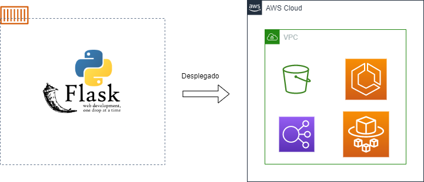

# Prueba Proteccion

## Problema:

Usted debe construir un aplicativo que reciba imágenes en formato JPG de cualquier dimensión (Ancho por alto). La
      aplicación debe procesar la imagen y definir el tamaño que debe tener la misma para entrar en una hoja tamaño A4 (796
      x 1123 pixeles) sin márgenes. El resultado debe contemplar las siguientes restricciones:
      1. La imagen no puede perder su ratio (Relación de aspecto ancho por alto)
      2. Se debe aprovechar el máximo de la hoja A4
      3. Ninguna imagen debe ser agrandada en el proceso, solo encogida cuando corresponda
      4. La orientación de la página se debe definir a partir de la orientación de la imagen (Horizontal/Vertical)
      
## Solucion:

Se desarrollo una aplicacion en flask la cual fue dockerizada y desplegada en AWS ECS la cual 
        consiste en un webservice en flask que recibe una o muchas imagenes, estas imagenes son procesadas
        para cambiar su tamanio a A4 y se suben a un bucket en AWS S3 para estar disponibles para su
        descarga.
        
        
                
-  ### Para correr
```docker compose up 
```        
        
        
        